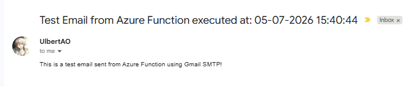

# TimeStampMailer

This project is an Azure Functions app that sends a test email on a scheduled timer. It uses a timer trigger to run every five minutes and sends an email through an SMTP server such as Gmail.

## What this project is about

It demonstrates how to build a simple serverless background process in C# that can automate email delivery. The function reads SMTP settings from environment variables and sends a message when triggered.

## How it can benefit you

This project is useful for learning how Azure Functions can automate routine tasks such as notifications, reminders, or reports. It also shows how to connect a function app to an email service using SMTP.

## Key points

- **Trigger:** Timer-triggered Azure Function running every 5 minutes.
- **Runtime:** Target framework is `net6.0` and Azure Functions v4 (in-process).
- **Storage:** Timer triggers require Azure Storage for schedule state. Use Azurite (local emulator) or a real Azure Storage account.
- **Config:** `local.settings.json` holds runtime and SMTP settings (do not commit secrets).

## Configuration (local)

1. Copy or edit `example.local.settings.json` into `local.settings.json` and set your values.
2. Important keys:
   - `AzureWebJobsStorage`: storage connection string (Azurite or Azure Storage)
   - `FUNCTIONS_WORKER_RUNTIME`: `dotnet`
   - `SMTP_HOST`, `SMTP_PORT`, `SMTP_ADDRESS`, `SMTP_USER_NAME`, `SMTP_PASSWORD`, `RECIPIENT_EMAILS`

If you use Gmail, create an App Password and use it for `SMTP_PASSWORD`.

## Run locally (recommended)

1. Install prerequisites:

```bash
# .NET 6 SDK
# Azure Functions Core Tools
# Node.js + npm (for Azurite)
```

2. Install and start Azurite (local storage emulator):

```bash
npm install -g azurite
azurite -s --location ./azurite_storage
```

3. Build and start the Functions host (from the project folder):

```bash
dotnet build
func start --verbose
```

The host will load the `TimeStampMailer` function and run it on the configured timer. Check logs for send status.

## Result


